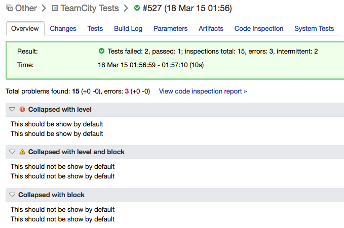

TeamCity plugin that allows to highlight key info for a running build on
*Build Overview* pages using [TeamCity service messages](https://confluence.jetbrains.com/display/TCD9/Build+Script+Interaction+with+TeamCity).



# Usage

Just print a message in a running build in format:

`##teamcity[highlight title='Some title' text='Some text' level='warn' block='collapsed']`

and it will end up in the build's Overview page.

Level parameter can be of `info`, `warn` or `error` and is optional. When not
specified, level info is used as default.
Optional Block parameter can be of `collapsed` or `expanded` and if not specified
the block will be expanded by default.

When more messages with the same title are sent, their texts get grouped
together and are shown line by line in the same block.

# Build

```bash
$ ./gradlew clean build dist
```

# Installation

- Remove old version of plugin from TeamCity's data plugin directory (e.g. 
  `/opt/teamcity-data/plugins/teamcity-highlighter-plugin-*.zip`)
- Copy `build/distributions/teamcity-highlighter-plugin-*.zip`
  into TeamCity's data plugins directory as described in TeamCity documentation
- Restart TeamCity server
